# EnjoyTrip

> HTML, CSS, JSP, Servlet, MySQL을 활용한 웹프로젝트

<div style="text-align:center">
    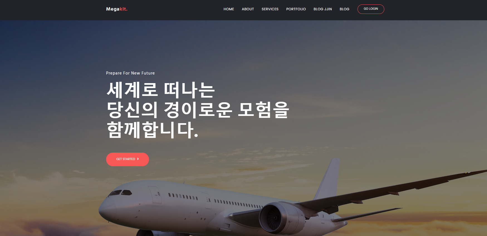
</div>

<br><br>

<hr>

### 구동 환경

|   구분   |             세부             |
| :------: | :--------------------------: |
|   IDE    |     Eclipse EE (2018-09)     |
|  Server  |     apache-tomcat-9.0.78     |
| Frontend | html/CSS/js, jsp, bootstrap4 |
|    DB    |        mySql(8.0.34)         |


<div style="text-align:center">
    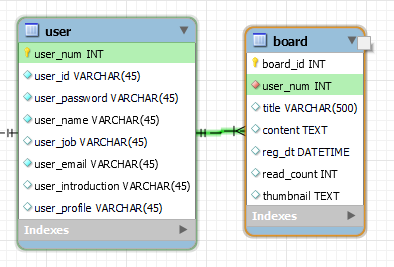
</div>

<br><br>

<hr>

### 구현 내용

#### \- 꾸밈용 페이지

> html, css 환경 적응을 위한 꾸밈 페이지 작성

|                   회사정보                    |                  추천 여행지                  |
| :-------------------------------------------: | :-------------------------------------------: |
| 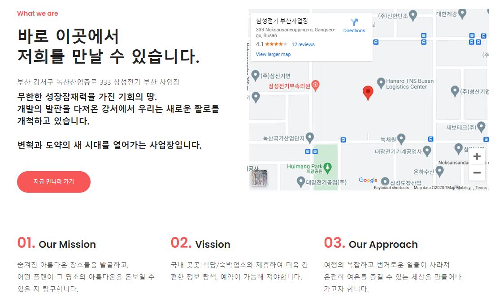 |  |

#### \- 게시판

> 로그인한 사용자에 한하여 게시글 작성 가능

<br><br>

-   다양한 크기의 디스플레이 지원

    |                    게시글과 마이페이지                    |                   세부 게시글 내용                   |
    | :-------------------------------------------------------: | :--------------------------------------------------: |
    |  | 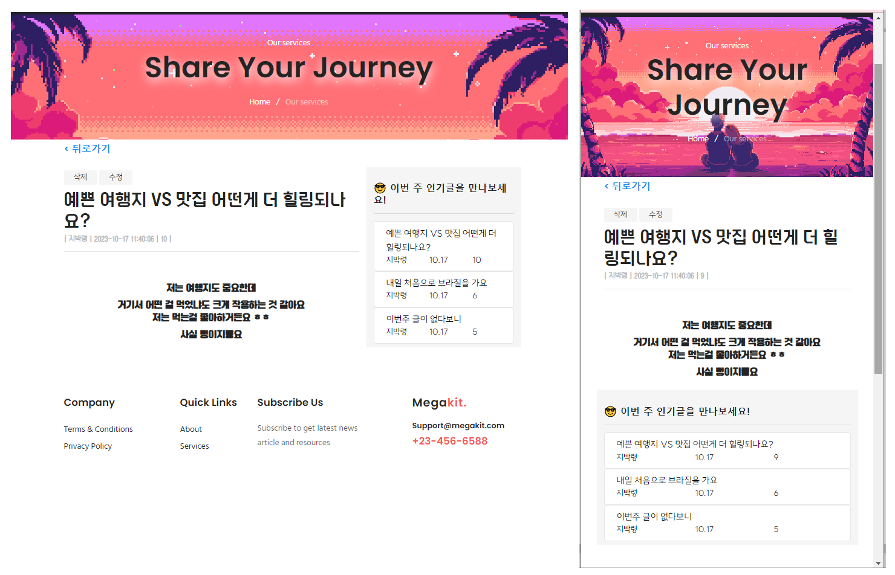 |

<br><br>

-   주간 인기 게시글

|                     주간 인기 게시글                     |                    1주일 내의 글만 표기                    |
| :------------------------------------------------------: | :--------------------------------------------------------: |
| 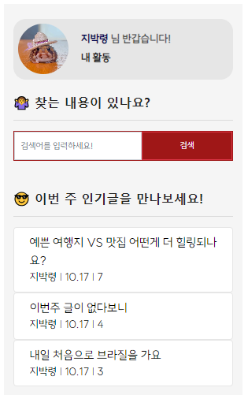 | 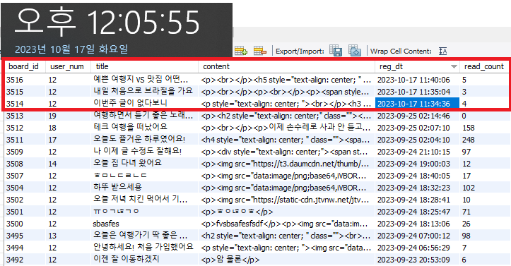 |

<br><br>

-   로그인 여부에 따른 화면 구성차이

|                     환영 페이지                     |
| :-------------------------------------------------: |
| 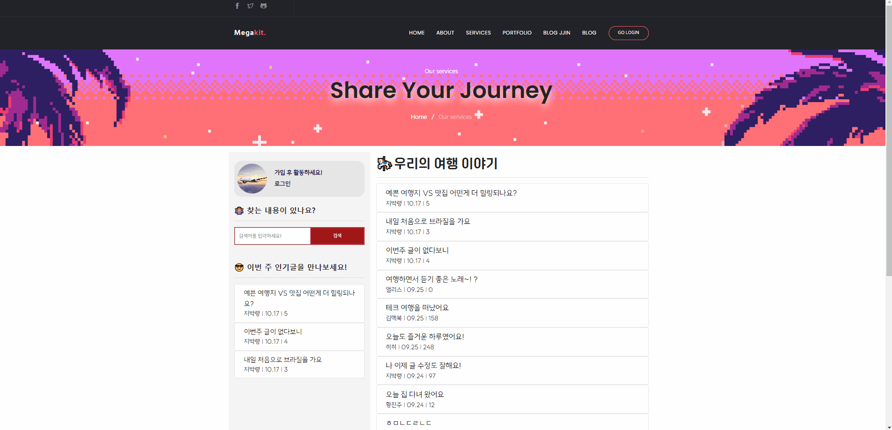 |

<br><br>

#### \- 게시판 : 글작성 및 수정

-   summernote를 활용한 자유로운 형식의 글작성 지원

|                       글작성                        |                    작성 글 확인                    |
| :-------------------------------------------------: | :------------------------------------------------: |
| 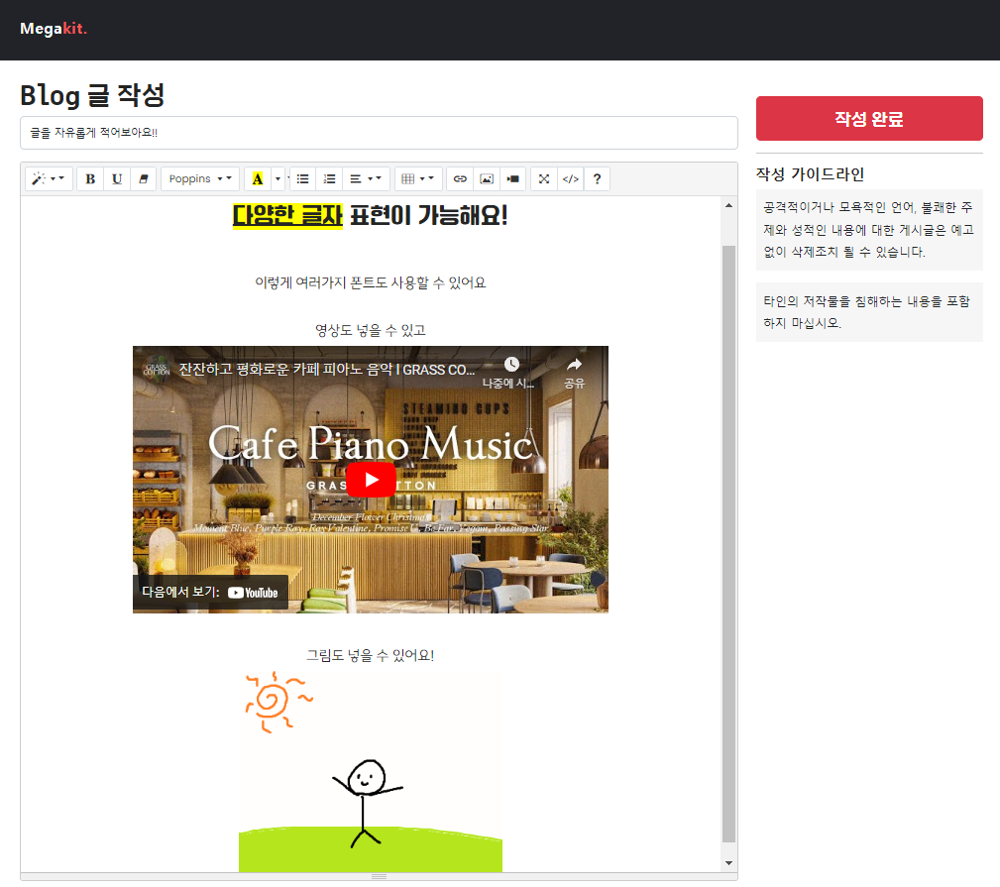 | 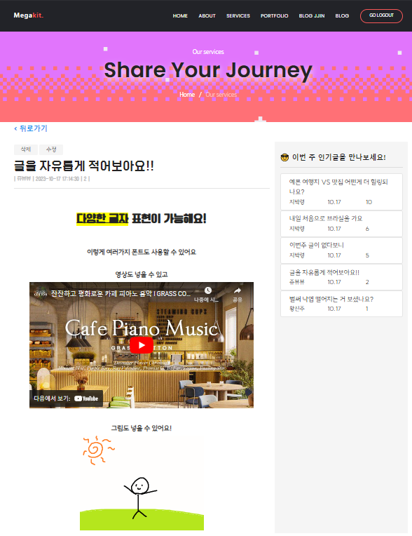 |

<br><br>

-   자신이 작성한 글에 한하여 수정/삭제 지원

<div style="text-align:center">
    
</div>

|                    내가 쓴 글                    |                     타인의 글                      |
| :----------------------------------------------: | :------------------------------------------------: |
| 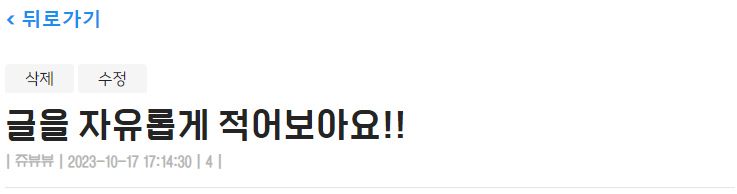 | 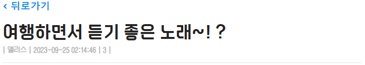 |

<br><br>

#### \- 마이페이지

> 회원정보 수정 및 작성 글 확인 가능

<div style="text-align:center">
    
</div>
 : 회원정보 수정/탈퇴, 건의사항, 내가 쓴 글목록 확인 가능

<br><br>

<hr>

### 구동 시 기본 추가 사항

<br>

1. context추가

```xml
<Resource
    name="jdbc/mysql"
    auth="Container"
    type="javax.sql.DataSource"
    driverClassName="com.mysql.cj.jdbc.Driver"
    url="jdbc:mysql://localhost:3306/enjoytrip"
    username="root" password="1234"
    initialSize="5"
    maxTotal="10"
    maxIdle="100" />
```

2. web.xml

```xml
<filter>
    <filter-name>encodingFilter</filter-name>
    <filter-class>org.apache.catalina.filters.SetCharacterEncodingFilter</filter-class>
    <init-param>
        <param-name>encoding</param-name>
        <param-value>UTF-8</param-value>
    </init-param>
    <init-param>
        <param-name>ignore</param-name>
        <param-value>false</param-value>
    </init-param>
</filter>
<filter-mapping>
    <filter-name>encodingFilter</filter-name>
    <url-pattern>/*</url-pattern>
</filter-mapping>
```
